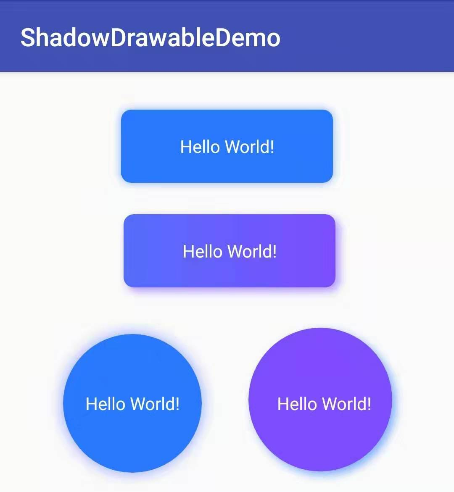
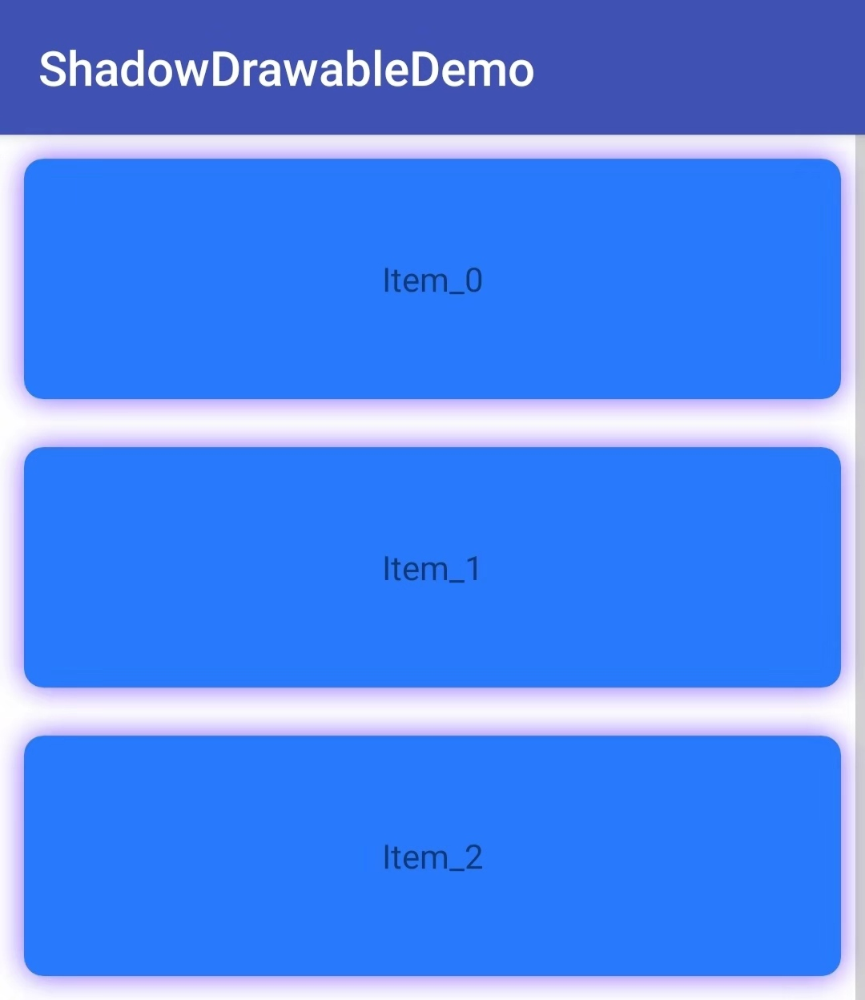
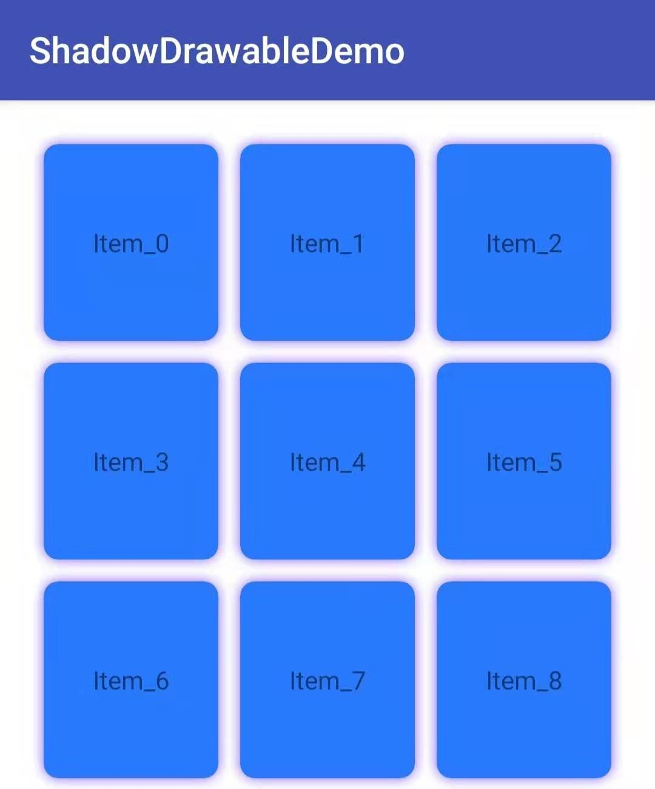

#### 添加依赖

在项目的build.gradle中添加：

    allprojects {
        repositories {
            ...
            maven { url 'https://jitpack.io'
        }
      }
    }
在APP模块下的build.gradle中添加依赖：

    dependencies {
        implementation 'com.github.Liberuman:ShadowDrawable:0.1'
    }

#### 使用

通过一行代码即可实现阴影效果

    /**
	 * 为指定View设置带阴影的背景
	 * @param view 目标View
	 * @param bgColor View背景色
	 * @param shapeRadius View的圆角
	 * @param shadowColor 阴影的颜色
	 * @param shadowRadius 阴影的宽度
	 * @param offsetX 阴影水平方向的偏移量
	 * @param offsetY 阴影垂直方向的偏移量
	 */
	public static void setShadowDrawable(View view, int bgColor, int shapeRadius, int shadowColor, int shadowRadius, int offsetX, int offsetY);
	
	// 实例：设置背景为颜色为#3D5AFE，圆角为8dp, 阴影颜色为#66000000，宽度为10dp的背景
    ShadowDrawable.setShadowDrawable(textView1, Color.parseColor("#3D5AFE"), dpToPx(8),
        Color.parseColor("#66000000"), dpToPx(10), 0, 0);

详细介绍可参考：[Android开发中阴影效果的实现](
https://juejin.im/post/5ae1ba4d6fb9a07acc116b8d)

#### 阴影效果

#### License

Copyright (c) 2018 Freeman

Permission is hereby granted, free of charge, to any person obtaining a copy
of this software and associated documentation files (the "Software"), to deal
in the Software without restriction, including without limitation the rights
to use, copy, modify, merge, publish, distribute, sublicense, and/or sell
copies of the Software, and to permit persons to whom the Software is
furnished to do so, subject to the following conditions:

The above copyright notice and this permission notice shall be included in all
copies or substantial portions of the Software.

THE SOFTWARE IS PROVIDED "AS IS", WITHOUT WARRANTY OF ANY KIND, EXPRESS OR
IMPLIED, INCLUDING BUT NOT LIMITED TO THE WARRANTIES OF MERCHANTABILITY,
FITNESS FOR A PARTICULAR PURPOSE AND NONINFRINGEMENT. IN NO EVENT SHALL THE
AUTHORS OR COPYRIGHT HOLDERS BE LIABLE FOR ANY CLAIM, DAMAGES OR OTHER
LIABILITY, WHETHER IN AN ACTION OF CONTRACT, TORT OR OTHERWISE, ARISING FROM,
OUT OF OR IN CONNECTION WITH THE SOFTWARE OR THE USE OR OTHER DEALINGS IN THE
SOFTWARE.